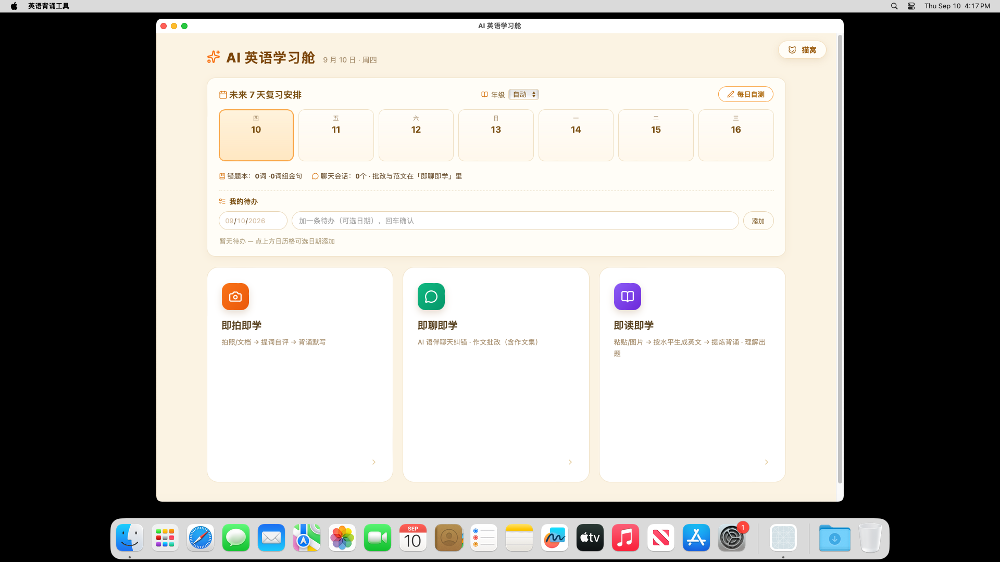

# 英语背诵与学习软件（cat paw）· 使用说明书

> 版本 **v8.1**（2026-09-27）· 全部功能本地离线运行 · 本版更新：内置词书**停用/恢复**、修复**中文名词书导入**
> 访问：`http://127.0.0.1:8804`
> 启动：封装版双击 `英语背诵工具.exe`（macOS 双击 `英语背诵工具.app`）｜源码版双击 `启动背诵工具.bat`
> 本文取代 `说明书-2026-09-05.md`（v7.3，不含词书系统与 PDF 导入）

---

## 一、这是什么

学生上传或粘贴英语阅读材料（课文、试卷、外刊文章），软件用**内置 AI**（Gemma 4，本机运行）自动提炼学习内容，学生自评筛出真生词，生成背诵清单，并通过**默写 + SM-2 间隔复习**巩固记忆。全程离线，数据不出机器。

**核心理念**：清单"宁多勿少"，精简靠学生自己的学习行为（认识划掉 / 答对达标），不是软件替学生拍板。

**定位**：学校课堂上老师会针对卷子考题提炼考点，但那是**面向全班**的；本软件补的是**课后自学那一段**——学生自己刷题、自己阅读时，也能给自己做一次**一对一的语境化提炼**。它不替代老师。

---

## 二、快速开始

1. **启动**：封装版双击 `英语背诵工具.exe`（或 macOS 双击 `英语背诵工具.app`）；源码版双击 `启动背诵工具.bat`
   （自动拉起 AI 引擎 + 网页服务并打开浏览器，冷启动约 8 秒）
2. **输入材料**：粘贴文本 / 📷 传图片 / 📄 传 PDF·Word
3. 点 **✨ 生成背诵清单**（约 13–15 秒）
4. 在**候选词自评表**点选 ✓认识 / ✗不认识（选择后揭示词义）
5. 点 **✅ 确认生成背诵清单**
6. 点 **✅ 已背完，开始默写**巩固
7. 每天点 **📅 每日自测**（系统自动安排到期复习）

---

## 三、功能详解

### 1. 输入方式（三种）

| 方式 | 说明 |
|---|---|
| **粘贴文本** | 直接贴英文，最稳最快 |
| **📷 传图片** | 拍照 / 截图 → 服务端先做预处理与裁剪 → **本机视觉模型识别**；内置乱码检测与头尾修补，识别质量不足会自动重试 |
| **📄 传文档** | PDF（文本型直接抽字；**扫描版会自动识别并提示改用拍照**）、Word、txt |

多文件可连续上传，识别出的文字会填入输入框，**可先手动编辑再生成**。

### 2. 提炼内容（五板块）

- **候选词**（单词，是唯一被筛选的板块）：考纲/分级/拓展归属 + CEFR 级别 + 原文语境 + 按文中语境的词义（专名或引申义会标注）
- **词组 / 搭配**：自由提取，给翻译
- **作文金句**：带中文翻译与赏析
- **语法点**：文中典型语法 + 讲解

### 3. 候选自评（核心交互）

- 候选词**不显示中文**，学生凭语境判断 → 认识的 ✓ / 不认识的 ✗ → 选择后揭示词义
- **筛选设置**：年级档（决定保留线：小学~大学）、**词书勾选（最多 3 本参与）**、拓展词开关
- **三连认识折叠**：某词连续 3 次选认识 → 之后自动折叠隐藏，不再打扰
- 手动 ✕ 划掉（可恢复）

### 4. 词书系统（📚 侧栏）★ v8.0 重点

**内置 5 本词书**（全部由公开许可数据源构建）：

| 词书 | 规模 | 说明 |
|---|---|---|
| **高考英语核心词表（全国）** | 3837 词 | **默认主词书** |
| 中考英语核心词表（全国） | 1600 词 | |
| CEFR 分级词表 | 7035 词头 | 带 A1–C2 分级 |
| 大学英语四级（CET-4） | 5183 词 | |
| 大学英语六级（CET-6） | 5974 词 | |

**＋ 添加词书**（三种格式，文件名即词书名）：

| 格式 | 用法 |
|---|---|
| **PDF 词汇手册** | 直接选 PDF，自动解析成词表（表格优先，实测 87 页手册约 5 秒抽出 3300+ 词） |
| **JSON 词书** | 标准词书格式，也接受裸数组 |
| **纯文本词表** | 每行一个词，可用 制表符 / 多个空格 / 冒号 分隔释义 |

其他操作：
- **★ 设为主词书**：点词书卡上的按钮即可切换。**切换主词书 = 换考纲**，之后提炼的「考纲」层就来自这本
- **主词书显示掌握进度条**；词条前 ✅/🔶 徽标 = 掌握状态，点击可改
- **A-Z 首字母索引**翻看 + 搜索
- **🔶 学习中 N 词 [查看]**：只列待处理词，可一键开自测
- **停用 / 删除**：内置词书可「停用」（**不删数据**，随时可在“已停用”区「恢复使用」）；用户导入的词书可「删除」（连同文件移除）。**主词书不能直接停用/删除**，需先切换主词书

> **为什么不内置各地官方考纲词汇手册？** 版权原因——官方手册不随软件分发。需要时请用上面「＋ 添加词书」导入**你自己合法持有的**词书文件（PDF 直接可导）。

### 5. 默写（✍️）

- **板块多选**：单词 / 词组·搭配 / 金句
- **数量**：25% / 50% / 全部 / 自定义
- **题型**：单词中译英（看义写词）与英译中（看词写中文，**AI 容错批改**：拼写近似、大小写、词形变化、近义表述都算对）随机混合；词组/金句为中译英
- **原文例句挖空**：把该词在原句中的位置留空，给你上下文线索
- 错题循环到全对，结束出统计（轮数 / 一次通过数）

### 6. 记忆层与每日自测（🧠）

- **掌握三分**：
  - ✅ 已掌握：连续 3 次自评认识 / 每日自测连对 3 次 / 手动标记
  - 🔶 掌握中：碰过但未达标（选过不认识、默写错过的）
  - 🚫 未遇见：从未处理过
- **SM-2 间隔算法**：每词独立复习计划——答对间隔指数增长（1→6→15→38→95 天），答错重置为明天必现
- **每日自测**：SM-2 到期词优先 → 错误多者其次，每天 **≤30 题**；顺带抽查 ≤3 个到期的已掌握词（防遗忘）
- **错题池**：判错的词优先复现
- 手动改状态与算法联动：✅ 降级 🔶 → 明天自动自测；改回 ✅ → 不再安排

### 7. 阅读与聊天（🗣）

软件还包含**阅读**与**聊天**模块：聊天可按人格设定做**英语语伴**（对话 + 纠错），并支持**作文批改**。加上提炼、默写与记忆层，**除听力外英语学习的各个环节基本都能在一个工具里完成**。

---

## 四、数据与隐私

- **全程本地**：模型、词书、OCR、记忆全部在本机运行，**不存在任何上传路径**；服务只监听本机地址（`127.0.0.1`），不对局域网暴露
- 学习记忆存**浏览器 localStorage**（掌握状态 / 错误次数 / SM-2 计划）
- 清除浏览器数据 = 重置学习记录（不影响词书与软件本身）
- 无账号、无遥测、无广告、无调用费用

---

## 五、系统要求与运维

| 项 | 封装版（推荐） | 源码版 |
|---|---|---|
| 需要装 Node / Python | **不需要**（已内置运行时） | 需要 Node；Python 可选（缺则文档解析/OCR 降级） |
| 需要下模型 | **不需要**（模型随包，约 3.9 GB） | 需要跑获取脚本（含 sha256 校验） |
| 磁盘占用 | 约 6.69 GB（单文件夹免安装） | 约 5.3 GB（模型 + 引擎） |
| 显存 | 运行时约 2.9 GB；**显存不足自动降级 GPU 层数** | 同左 |
| 端口 | 8804（网页）、8080（引擎）、11434（Ollama，仅回退用） | 同左 |
| 启动 / 停止 | 双击启动器 / 关闭窗口；必要时任务管理器结束 `llama-server`、`node` | 双击 `启动背诵工具.bat` |

## 六、常见问题

- **生成清单失败或很慢？** 引擎未启动或显存被其他程序占用。软件已内置容错（单次失败不会导致服务整体退出），重试一次通常即可；若反复失败，重开启动器。
- **跑 ComfyUI 等占显存任务时**：引擎可能被挤掉 → 网页自动回退 Ollama（文字可用，识图降级）；任务结束后重开启动器。
- **PDF 导不进词书？** 若是**扫描版 PDF**（没有文字层），软件会明确提示——请改用「拍照」逐页识别，或换文字版 PDF。
- **图片识别缺段/乱码？** 自动重试已内置；**双栏排版建议单栏截图**。
- **导入的词书在哪？** 存在软件 `data/books/` 下，可随时删除。
- **金句没进默写池？** 需含中文翻译（新版提取会自动带）。

## 七、版本变更（v7.3 → v8.0）

**新增**
- **词书系统**：内置 5 本 + 添加词书（**PDF** / JSON / 文本）+ **设为主词书**（切换即换考纲）
- **PDF 词汇手册导入**（表格优先解析，87 页约 5 秒）
- **词书停用/恢复**：内置词书可「停用」（不删数据、随时可恢复）；用户导入的词书可「删除」；主词书受保护（需先切换）
- 交付形态：**封装桌面软件**（内置运行时与模型，双击即用）

**变更**
- 默认主词书由地方考纲词书改为**「高考英语核心词表（全国）」**；各地官方考纲手册因版权不再内置，改由用户自行导入
- 提炼的 token 预算提高，并新增**模型输出截断的自动修复与重试**

**修复**
- 修复一处缺陷：请求处理中的错误此前会导致**整个网页服务退出**（现在只影响该次请求）
- 修复副词书候选层不生效、词书勾选无法取消的问题
- 修复**纯中文名词书无法导入**的问题（现按名称生成稳定 id，中文文件名的词书可直接导入）

## 八、已知限制

- **听力**未覆盖（能力边界：覆盖除听力外各环节）
- 双栏排版图片的列切分未做（建议单栏截图）
- PDF 表格中跨行截断的长词可能解析不到
- 记忆数据在 localStorage，换浏览器或清缓存会丢

---

*本说明书随软件版本更新。以软件实际界面为准。*
